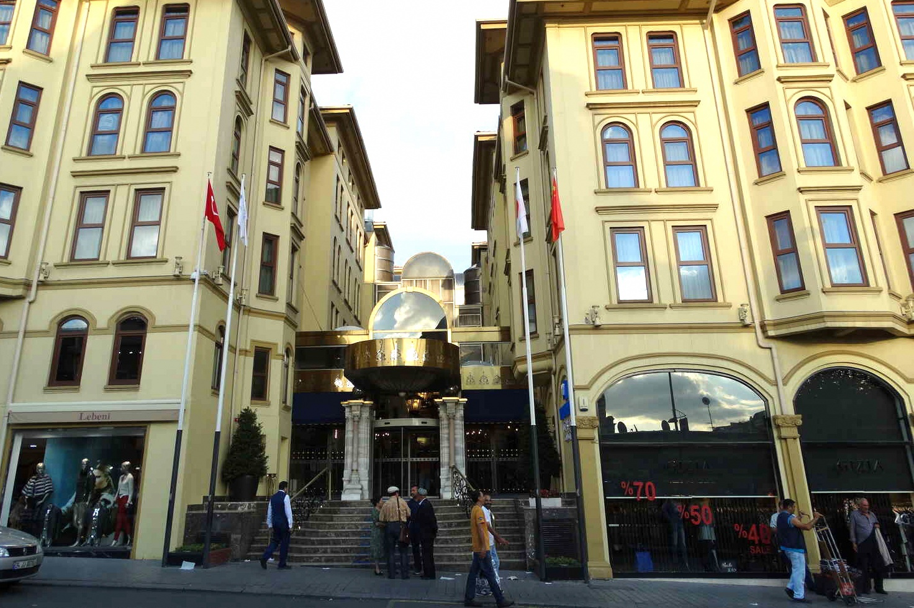
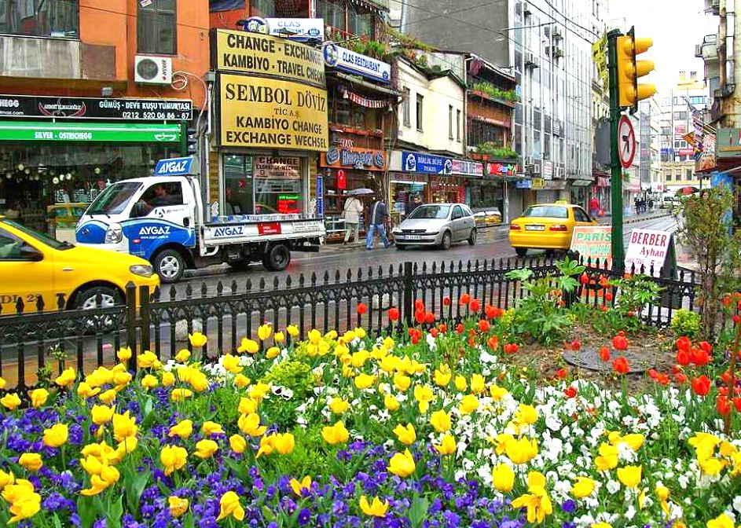

## Shopping in Istanbul

To visit Istanbul and not to stroll through the local shops and not buy a new thing - it means to come to the capital of Turkey in vain. Local shopping malls and markets are located in neighborhoods that are protected. That is why all retail outlets are the property of the whole country.

The distinctive Istanbul is one of the centers of world trade. Do you remember the well-known path "from the Varangians to the Greeks" or "shuttle business" in the 90s (when people with a tourist visa in their hands travel to foreign countries and sell a variety of goods)? In both cases, it was the Turks who discovered the world of trade. Russians mainly bought clothes in the Turkish region of Laleli.

### Invaluable Istanbul Shopping Tips

On the market, they pay only in cash - any convertible currency. It is better to have local Turkish lira with you, paying in dollars or euros is not profitable for you.
Pay attention to fakes. So, seemingly identical things can cost differently: most likely, one of the sellers decided to get rich.
Check in advance about the goods that cannot be exported from Turkey. Otherwise, you can run into a fine. For example, the following are forbidden: cigarettes and tobacco (except for hookah), a Turkish handmade carpet, which is more than a hundred years old, then look for the TAC brand; this company has long established itself on the good side. Quality clothes for adults and children are produced by LC Walkiki.
The ideal time for shopping with discounts is the end of July and the first half of August, with a seasonal change of collections.
Calendar of festivals and sales in Istanbul in 2020
Turkey is open to Russian tourists at any time of the year. But it is more profitable to fly here in the summer - you can swim at the sea.

The Festival will run from June 30 to July 17, 2020. This is the largest event organized primarily for travelers. Sales will be going on in the markets and shopping malls during these two months, world brand items - absolutely everything will be reduced in price. As a rule, during the festival, shopping centers switch to round-the-clock operation. Lovely! Festival discounts will pleasantly surprise you too!

More about Istanbul Shopping Festival
The famous tulip festival in 2020 is scheduled from 9 to 30 April. The tulip is a symbol of the country; about two thousand varieties of this flower grow here. What makes the event special is that all tourists are given free tulip bulbs. As you might guess, most of the city's guests are florists, florists and breeders from all over the world.

